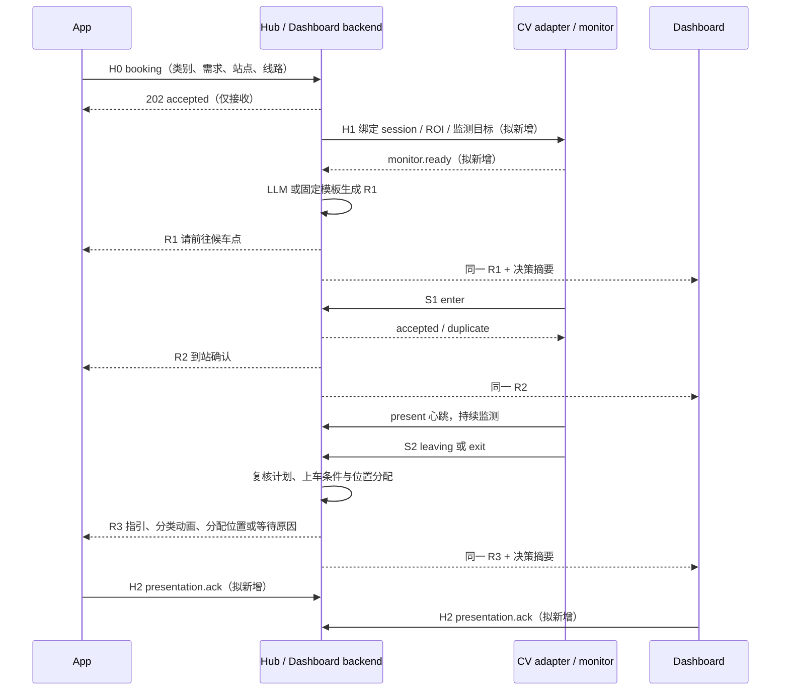

# App、CV 与 Dashboard 多轮握手接口机制

> 文档日期：2026-10-03。范围：需求提交 → 引导到站 → 信号 1 到站 → 信号 2 离开候车 ROI → 上车指引及座位展示。
> 本文为**当前链路核查 + 建议对接协议**，不代表新增接口已经实现。当前接口与拟新增字段分别列出；本文不修改运行代码。

## 1. 目标与基本约定

App 提交乘客自选的辅助需求类别（wheelchair、stroller、cane 等）及具体需求；Hub 将请求交给 Dashboard 后端的 LLM 或固定规则/模板，生成第一轮到站指引。App 和 Dashboard 展示同一份乘客内容，CV 持续监测。CV 信号 1 表示目标进入候车 ROI，产生第二轮到站确认；信号 2 表示目标将离开或已离开 ROI，触发第三轮上车指引、分类动画及座位/轮椅位展示。

“辅助需求类别”不是身份识别结果，也不全是残疾类别，例如 stroller 表示婴儿车需求。App 自报类别决定所请求的帮助，CV 类别用于现场观察及一致性检查，不应直接覆盖 App 的选择。

三方通过现有 **Signal Hub** 交换事件。Hub 是 Dashboard 后端的协调组件，不要求新增第四个独立产品。状态由 Hub 统一维护；App 与 Dashboard 不各自推断一套上车状态。

必须区分以下事实：

- HTTP 接收成功：Hub 收到了请求，不代表车辆已执行或动画已播放。
- 信号 1：候车区域出现符合条件的目标；未绑定个人时不能声称识别了某个用户。
- 信号 2：将离开/已离开指定区域，不自动等于上车完成。
- 上车许可、座位预留和上车完成：需要各自的权威确认，LLM 文案和动画播放完成均不能代替这些确认。

## 2. 已有链路核查

**后续实现更新（2026-10-03）：** App 已接入信号 2。当前 booking 先收到带 ROI 的正触发，再收到同 ROI、时间不早于进入的有效 `event=exit / triggered=false`，会锁存显示 **Please board the bus**，并继续显示 Hub 的上车指引；SSE 和轮询均支持。普通 false 不触发。断线隐藏操作提示，恢复后继续；取消、替换、过期使其失效。本更新只接入退出展示，没有实现下文 v2 会话协议、共享动画或结构化座位分配。以下核查表保留最初核查时的状态，相关 App 信号 2 缺口以本段更新为准。


核查的是本机工作区源码，而非线上运行状态：App 仓库 HEAD `25fcbbb`（含已有未提交修改），BusTech HEAD `7160917`。另只读检查 `/Users/franz/bustech-detect/monitor_zone.py`；该目录未能取得 Git revision。本次未启动摄像头、真实车辆或手机联调，未运行 App 单元/UI 测试；文档中的“已有”指源码存在。

| 环节 | 当前实现和证据 | 与目标的差距 |
|---|---|---|
| App 需求建模 | `BusPulse SG/Core/Assistance/AssistanceModels.swift`、`HubBookingContract.swift`：类别、需求、坡道偏好、线路、站点 | 可复用；不能仅凭类别隐式授权坡道 |
| App → Hub | `HTTPVehicleCloudService.swift`：`POST /api/booking`，Bearer，要求 202 且 `accepted:true`，同一事件保留重试内容；取消发送 `active:false` | 当前为单 booking；取消无原子条件检查 |
| Hub → App | `PassengerFeedbackService.swift`、`HubBookingContract.swift`：`GET /api/state` + `/api/events` SSE | App 解码 `zone.triggered`，未解码 `zone.event/left` 或顶层 `journey`；尚未形成信号 2 的显式消费 |
| App 到站反馈 | `HubSnapshot.hasTrigger` 匹配 booking event、线路、站点和观测时间，正触发锁存；到站车辆另检查 STOPPED、驻车制动、年龄 ≤1500 ms | 当前正信号允许最近 10 秒、最多未来 5 秒且晚于提交；这是区域关联，不是个人跟踪；车辆到站不等同信号 2 |
| 独立 CV monitor | `/Users/franz/bustech-detect/monitor_zone.py`：ROI 内占用、连续帧进入/退出消抖；进入记录 `TRIGGER` | 有内部退出状态，但日志输出不能直接充当完整的联网双信号协议 |
| CV → Hub bridge | BusTech `vision/yolo_bridge.py`：`POST /api/perception`；`zone.event=enter/present/exit`、`triggered`、`roi_id`、退出 `left` 类别 | 已有进入和离开事件；没有 `leaving` 预测事件，没有 App booking 与个人 track 的可靠绑定 |
| CV 时间语义 | bridge 默认进入持续 0.3 秒、区域无人持续 2 秒退出，区域有人时每 2 秒心跳；激活后任何人在 ROI 内都可维持占用 | 属于区域级清空检测；某人离开但其他人仍在时，不会产生该人的退出信号 |
| Hub 状态 | `dashboard/backend/hub.mjs` + `journey.mjs`：`IDLE → BOOKED → AT_STOP → ON_BOARD`；snapshot 已含 `journey.guidance` 和 `journey.seat` | 当前采用“AT_STOP 后 false + 原计划 READY + 类别匹配”推断 ON_BOARD，属于演示假设 |
| 规划与文案 | `hub.mjs`、`planner/agent.mjs`、`planner/policy.mjs`：booking 规划；CV 变化优先复核旧计划或用本地规则重规划 | 当前并非每个 CV 信号都调用一次 LLM；符合“LLM 或固定响应”，需统一阶段输出 |
| Dashboard 动画/摘要 | `dashboard/app/components/TwinPanel.tsx`、`app/lib/twinScenario.ts` 消费 journey；`app/live-dashboard.tsx` 展示 `decision_summary` | 已有等待/上车演示；App 尚无共享 animation ID 协议，不能假设 Web 动画能直接在 iOS 播放 |
| 座位 | `journey.mjs`：轮椅用 `WHEELCHAIR_BAY`，其他按 `S02/S03/S09` 循环 | 当前 journey 逻辑不是实时空位查询和原子预留，不能作为真实座位分配完成的证据 |

**旧文档差异：** `docs/bustech-integration.md` 中 bridge 恒报 `target_match_confirmed:false`、座位来自空位选择等描述，不应直接套用到当前 BusTech 源码。当前 bridge 按 `bool(detections)` 设置该标志；这仍只证明区域内有检测目标，不证明目标与 App 乘客身份一致。当前 Hub 使用 fixture 车辆/几何数据并将年龄置零，App 自行执行五分钟过期，不等同 Hub 的真实 TTL。

## 3. 三方责任与分发策略

| 生产方 | 信号/内容 | Hub 处理 | 消费方 |
|---|---|---|---|
| App | 类别、具体需求、线路/站点、交互语言、坡道偏好 | 创建会话、绑定 booking、生成 R1 到站指引 | Dashboard、App；向 CV adapter 提供监测绑定 |
| CV | S1 `enter`、持续 `present` | 验证 ROI、绑定、时效、顺序；记录到站；生成 R2 | App、Dashboard |
| CV | S2 `leaving` 或 `exit` | 记录阶段证据，检查上车条件，更新或复用有效计划；生成 R3 | Dashboard 规划器与 App；Dashboard 展示 |
| Dashboard 后端规则/LLM | 阶段文案、决策摘要、动画选择建议 | schema 校验、计划版本校验；按权威事实合成输出 | App 接收乘客内容；Dashboard 另接收摘要 |
| 座位服务/当前演示替身 | 位置分配结果 | 关联 session、plan revision、有效期与 reservation | App 与 Dashboard 同步位置编号 |
| App / Dashboard | 接收/展示回执（拟新增） | 独立记录每个消费者进度 | 运维/协调器；不回馈为车辆执行确认 |

CV 不直接调用 App，也不把原始视频转发给 App。两个客户端消费同一版本的 `guidance`；Dashboard 可额外显示输入事实、规则命中、缺失条件和 `decision_summary`。这里的“推理过程”指可审计决策摘要，而非依赖模型内部思维文本的业务协议。

## 4. 多轮握手与状态机（目标协议）



H1 不能阻塞第一轮“前往候车点”提示；若监测未就绪，应同时展示“自动检测暂不可用”，不得假装正在识别。CV 服务持续运行，不随 App 切后台停止；App 恢复前台时补取 Hub 状态。

| 目标状态 | 进入条件 | App / Dashboard 共同内容 |
|---|---|---|
| `BOOKED` | booking 已接收 | R1：按类别解释帮助、引导到站，说明监测可用性 |
| `AT_STOP` | 本 session 首次有效 S1 | R2：确认区域检测；有可靠目标绑定才可说“我们已识别到你进入候车区” |
| `DEPARTURE_PENDING` | 本 session S2 `leaving` | R3：上车准备或等待；不是“已经离开” |
| `LEFT_STOP` | 本 session S2 `exit` | R3：按车辆、计划和方向证据决定上车指引或离站提示 |
| `BOARDING_GUIDANCE` | 当前计划通过规则检查，具备相应上车条件 | 展示上车动画和已分配位置；模拟模式明确标注演示 |
| `ON_BOARD_CONFIRMED` | 另有车内检测/操作员等确认 | 完成提示；不能由动画播放结束自动进入 |
| `CANCELLED / EXPIRED` | 用户取消/服务端 TTL | 停止本 session 内容、撤销分配、解除监测绑定 |

这些是拟扩展的业务状态，不是现有 `journey.stage` 枚举。兼容期由 adapter 将现有 `BOOKED/AT_STOP/ON_BOARD` 映射到新协议；现有 `ON_BOARD` 只能映射为演示上车阶段，不能映射为真实确认。

`leaving` 要求 CV 有退出带、方向或轨迹预测逻辑；当前只支持 `exit` 时可直接走 `AT_STOP → LEFT_STOP`，不得从一次检测丢失虚构“即将离开”。R2 应保存为独立消息，即使很快收到 R3，也不能被跳过或无限等待动画后才更新状态。

## 5. 当前可复用的 HTTP / SSE 契约

### 5.1 App 提交需求

`POST /api/booking`，`Authorization: Bearer <token>`，`Content-Type: application/json`。示例为当前字段，不含拟新增 session 字段：

```json
{
  "event_id": "app-booking-example-001",
  "observed_at": "2026-10-03T08:00:00.000Z",
  "payload": {
    "active": true,
    "intent": "BOARDING",
    "route_id": "DEMO_ROUTE",
    "stop_id": "DEMO_STOP",
    "accessibility_need": "WHEELCHAIR",
    "ramp_preference": "REQUESTED",
    "assistance_requested": ["WHEELCHAIR_RAMP", "ADDITIONAL_BOARDING_TIME"],
    "preferred_interaction": "VISUAL",
    "language": "en-SG"
  }
}
```

首次成功为 HTTP 202，返回包含 `accepted:true`、`duplicate:false`、`changed` 的对象；重试可返回 `duplicate:true`。示例时间需替换为实际 UTC 时间。取消沿用当前 payload 并设 `active:false`，使用新的 event ID 和时间；对取消本身的重试则复用原字节。

### 5.2 CV 上报信号

`POST /api/perception`，使用相同认证与外层 `event_id / observed_at / payload`。两个 payload 示例：

```json
{
  "yolo_detections": [{"label": "WHEELCHAIR", "confidence": 0.94}],
  "target_match_confirmed": true,
  "zone": {"triggered": true, "roi_id": "stop-a", "event": "enter"}
}
```

```json
{
  "yolo_detections": [],
  "target_match_confirmed": false,
  "zone": {"triggered": false, "roi_id": "stop-a", "event": "exit", "left": ["WHEELCHAIR"]}
}
```

第一例标志反映当前 bridge 行为，不可作为个人身份匹配凭证。`present` 是心跳，不是重复 S1；`left` 是离开的辅助器具类别列表，不是乘客 ID 列表。当前 schema 不接受 `leaving`；必须先升级契约再发送。

### 5.3 反馈读取

- `GET /api/state` 返回 snapshot，当前包含 `channels`、`context`、`running`、`result`、`journey`。
- `GET /api/events` 返回 SSE；事件类型在 JSON 的 `type` 中，不能假设存在同名 SSE `event:` 行。
- `signal` 的 snapshot 在 `data.snapshot`；初始 `snapshot` 的状态在 `data`；`planning / summary / result / failure` 需按类型解码。
- 当前 SSE 连接先推送当前快照，但不支持历史回放。支持请求头名称 `Last-Event-ID` 不代表已有重放实现。
- 当前 `result.request_id` 是规划 run ID；不能当作 App booking ID。使用 `channels.booking.event_id` 关联请求，未来新增显式 session/revision。

## 6. 类别、需求与动画的分配

| App 类别 | 建议需求，用户可确认/调整 | R1 / R2 | R3 内容与位置 |
|---|---|---|---|
| `WHEELCHAIR` | 额外上车时间；坡道单独 REQUESTED/DECLINED/UNSPECIFIED | 无障碍候车点指引、到站确认 | 轮椅上车动画；轮椅位编号与固定指引 |
| `STROLLER` | 额外时间；按用户选择确认坡道 | 婴儿车候车点指引、到站确认 | 婴儿车上车动画；合适空间或座位，不能默认占用轮椅位 |
| `CANE / CRUTCH / WALKER` | 额外时间、需要时提供声音指引 | 易达候车位置、到站确认 | 步行辅助上车动画；已预留优先座位编号 |
| `VISUAL_ASSISTANCE` | 车辆身份确认、语音上车指引 | 同步语音与可访问文本 | 语音描述路径与位置；动画不能是唯一输出 |
| `HEARING_ASSISTANCE` | 视觉上车指引 | 文字/视觉确认 | 文字、动画和编号 |
| `MOBILITY_ASSISTANCE / NONE / UNKNOWN` | 明确需求或通用帮助 | 通用引导；必要时询问 | 通用动画；不猜测类别和座位 |

以上是目标映射策略，非当前所有默认值。App 现有自动交互逻辑对视力辅助选 AUDIO、其他选 VISUAL；`withAutomaticFeedback` 当前将语言设为英文。扩展时须明确保留用户选定语言和 BOTH 的规则。

动画由受控资源表映射，例如 `wheelchair.boarding.v1`；标识符是**建议命名，未核实同名资源存在**。Hub 输出 animation ID、版本和语义参数，App/Dashboard 各自匹配平台资源；不让 LLM 任意生成 URL。没有匹配资源时回退到同一份文字/语音。Dashboard 现有 twin scenario 可由 adapter 接入资源表。

座位必须由 Hub 接入的分配器返回（演示可使用显式模拟分配器），包含位置类型、编号、预留状态、有效期和版本。真实模式需检查占用并原子预留；无位置则返回等待/不可用。两端和 LLM 都不能自行编造或分别分配编号。轮椅位是 bay，不应显示成普通 seat。

## 7. 拟新增 v2 契约（尚未实现）

保持现有 `/api/booking`、`/api/perception` 冻结格式；新协议建议使用 `/api/v2/...` 命名空间，先协商能力，再由 adapter 转换。以下路径与字段均为提案，不能直接向现有服务调用。

| 接口 | 作用 |
|---|---|
| `POST /api/v2/sessions` | 创建会话；返回 `session_id`、booking event ID、过期时间、monitor 状态 |
| `GET /api/v2/monitor/events` + `POST /api/v2/monitor/acks` | CV adapter 领取绑定/解除绑定指令并回报 ready/failed；确认 camera、ROI、版本 |
| `POST /api/v2/perception` | 在原观测外增加 session、相机、track、sequence、ROI 配置版本与 enter/leaving/exit 证据 |
| `GET /api/v2/sessions/{id}` + `GET /api/v2/sessions/{id}/events` | 状态补取及可恢复事件流 |
| `POST /api/v2/sessions/{id}/presentation-acks` | App/Dashboard 独立报告 received/displayed/played/failed |
| `POST /api/v2/sessions/{id}/cancel` | 带 expected revision 原子取消，释放预留和绑定 |

统一业务事件示例（信号 2 后的乘客输出，座位值仅为示例）：

```json
{
  "schema_version": "2.0",
  "event_id": "guidance-example-003",
  "session_id": "session-example-001",
  "booking_event_id": "app-booking-example-001",
  "causation_id": "cv-exit-example-001",
  "type": "passenger.guidance",
  "sequence": 3,
  "state_revision": 7,
  "observed_at": "2026-10-03T08:01:10.000Z",
  "expires_at": "2026-10-03T08:05:00.000Z",
  "payload": {
    "stage": "BOARDING_GUIDANCE",
    "round": "R3",
    "plan_revision": 2,
    "simulated": true,
    "guidance": {
      "language": "zh-CN",
      "display_text": "演示：请按指引前往轮椅位 WB01。",
      "audio_text": "演示：请按指引前往轮椅位 WB01。"
    },
    "animation": {"id": "wheelchair.boarding.v1", "version": 1},
    "allocation": {"kind": "WHEELCHAIR_BAY", "id": "WB01", "status": "SIMULATED"}
  }
}
```

约定：`event_id` 唯一标识消息；`session_id` 标识一次乘车会话；`booking_event_id` 关联 App 原始请求；`causation_id` 指向触发该输出的 CV/需求事件。Hub `sequence` 在 session 内单调递增；`state_revision` 是业务状态版本，`plan_revision` 是所依赖的计划版本。相机另外携带 `producer_id / producer_epoch / producer_sequence` 防止重启或乱序混淆。字段缺失或版本不支持返回可诊断错误，不做隐式猜测。

目标绑定用 `{session_id, camera_id, roi_id, roi_revision, track_id, binding_method}`。没有稳定 track 时允许 `binding_method=single_session_demo`，但只支持受控单人演示；多人、同类目标或歧义时进入待确认，不向所有同类 booking 广播“你已到站”。

展示回执至少带 `{event_id, state_revision, consumer_id, status, displayed_at}`；每个终端独立确认。App 离线不阻塞 Dashboard 和 CV；缺少回执表示未确认送达，不表示用户未到站。`played` 只表示动画播完。

## 8. 顺序、幂等、恢复与异常

1. **事件幂等：** 同一消息超时重试保留原 ID、时间和字节；服务端相同 ID 相同内容返回 duplicate，不重复 R2、动画或分配。相同 ID 不同内容返回冲突。现 Hub 去重仅内存最近 512 条，v2 应覆盖整个会话及重试窗口并持久化。
2. **顺序：** Hub 只按会话接受有效转移。先收到 S2 而没有 S1 时保存待核对证据，不直接上车；重复 `present` 不重复 R2。`leaving → exit` 属于同一离站过程，只播放一次相应动画。
3. **反向移动：** leaving 后重返 ROI，撤销离站准备；exit 后重入产生新访问周期，不重复消费旧 S2。需要 `visit_id` 或等价周期编号，不能永久锁存一次 trigger。
4. **时效：** 服务端控制 session TTL（首版建议沿用五分钟），同时检查观测时间、接收时间、相机健康和 ROI 版本；相机断流/暂停是 UNKNOWN，不能作为 exit。实际容差与消抖参数应在联调配置中固定并记录。
5. **规划竞争：** R3 仅引用当前 session 和 plan revision；旧 LLM 请求晚到必须丢弃。固定规则可立即产生确认/等待文案，不需等模型完成。LLM 故障回退固定模板，保持同一事件与版本规则。
6. **离线恢复：** v2 用持久化事件日志和游标补发；游标过期时返回最新状态及未确认 presentation 列表。当前 v1 仅能恢复 snapshot，不能保证补回离线期间的短 enter/exit。
7. **取消/替换：** 结束旧 session，清理绑定、展示队列及座位预留；旧 CV/LLM 回调不得恢复旧内容。当前 singleton booking 的替换和取消存在竞争窗口，必须在服务端做条件更新。
8. **类别不符：** 保留用户需求，展示等待确认并通知 Dashboard，不自动降低辅助级别。CANE/CRUTCH 等近似类别映射由明确规则维护。
9. **权限和数据：** 演示沿用 Bearer；部署时区分 App 提交、CV 观测、Dashboard 读取/操作权限。只传必要的类别、位置与匿名关联 ID，不在协议中放密钥、原始视频或无关个人信息。

## 9. 落地顺序与验收

| 顺序 / 责任方 | 工作项 | 验收标准 |
|---|---|---|
| 1 / Hub + CV | 明确 busstop ROI、离站方向、enter/exit 定义；把 monitor 接入现有 bridge | 实测一次进入和离开，产生可关联 S1/S2；暂停或断流不产生假 S2 |
| 2 / Hub + App | 先补齐现有 `journey`、`zone.event/left` 解码，统一乘客文案来源 | 双端同一 booking 显示 R1/R2/R3；说明 v1 的区域级与模拟边界 |
| 3 / Hub | 实现 v2 会话、绑定、状态版本、持久化与原子取消 | 取消、替换、乱序、过期不复活旧状态；多人不串单 |
| 4 / Dashboard + App | 建立分类动画资源表及回执；保留可访问文本/语音 | 三类 wheelchair/stroller/cane 均正确；重复事件不重复播放；缺资源可回退 |
| 5 / Hub + 位置数据提供方 | 接入空位/轮椅位状态与原子预留 | 两端编号一致；无空位不编造；取消释放；并发不重复分配 |
| 6 / 三方 | 实机与摄像头端到端联调 | 分别留存输入、ACK、状态版本和两端展示证据；演示结果与真实车辆结果分开记录 |

最小验收矩阵：正常双触发；leaving 后折返；exit 先于 enter；重复/延迟事件；两位同类乘客；有人留在 ROI 时另一人退出；CV 断流；App 切后台后恢复；LLM 失败；规划过程中取消；座位不足；动画缺失；语言/语音输出；模拟模式标识。

本次仅新增本文档，并核对源码及文档示例结构。已有历史测试记录见 [BusTech 集成说明](bustech-integration.md)，不作为本次三方 E2E 已通过的声明。下一步实现应遵循仓库要求执行 App 单元/UI 测试，并补齐上述真实链路验收。
