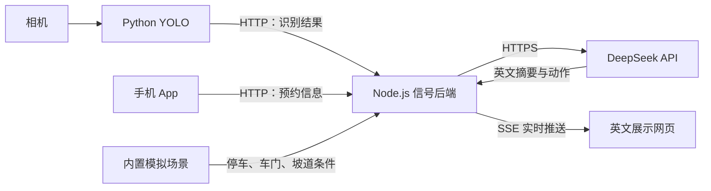

# AccessRide 后端配置与联调指南

这份指南用于你们当前的巴士比赛网页演示。**后端已经实现，不需要重新开发，也不需要车端设备。** 网页、Thinking 摘要、Action 和乘客提示保持英文；本文用中文说明配置步骤。

现有集成版在本机的目录是：

```text
C:\Users\Lloyd\Documents\ChatGPT\bus比赛vla\RideAssistant_demo
```

下面的命令在 **Windows PowerShell** 中执行，另有注明的除外。队友使用自己的项目路径。当前集成改动尚未推送到 GitHub，直接克隆旧远端不一定包含这里的脚本，应使用这份集成版代码。

## 1. 先理解每一部分放在哪里



| 部分 | 作用 | 默认地址或入口 |
|---|---|---|
| 展示网页 | 显示输入、Thinking、Action、乘客提示 | `http://127.0.0.1:3000` |
| 信号后端 | 接收 App/YOLO，调用 DeepSeek，推送结果 | `http://127.0.0.1:8787` |
| Python YOLO | 读取相机并发送检测标签、置信度 | `integrations/camera_yolo.py` |
| 模拟车辆场景 | 自动提供停车、开门等演示条件 | 已内置，无需额外运行 |

可以把网页和后端放在同一台电脑，也可以让 YOLO 在另一台电脑运行。后端需要能访问 DeepSeek；手机和 YOLO 不需要拿到 DeepSeek key。

## 2. 准备运行环境

需要 Node.js **22.13 或更新版本**。发送 Python 演示信号还需要 Python；真正运行相机识别时，使用视觉同学已经安装 OpenCV、Ultralytics 的环境和你们的模型权重。

先打开一个 PowerShell 窗口，进入项目目录：

```powershell
cd 'C:\Users\Lloyd\Documents\ChatGPT\bus比赛vla\RideAssistant_demo'
node --version
npm.cmd --version
```

首次在一台新电脑运行，安装项目依赖：

```powershell
npm.cmd ci
```

当前这台电脑已经安装过依赖，可以跳过这一步。Windows 下使用 `npm.cmd` 可以避免 `npm.ps1` 被执行策略拦截。

## 3. 先在本机跑通

如果当前演示已经在运行，可以直接打开网页使用。需要重启时，先在启动旧服务的终端按 Ctrl+C，避免重复占用端口。

在项目目录运行：

```powershell
node scripts/dev-integrated.mjs --key-stdin
```

看到 `DeepSeek key input` 后，粘贴自己的 DeepSeek key，按回车。输入不会显示，也不会被脚本保存到文件。随后应看到：

```text
Signal bridge: http://127.0.0.1:8787
Local: http://127.0.0.1:3000
```

打开 [本机网页](http://127.0.0.1:3000)，按以下顺序检查：

1. 顶部显示 **Signal server connected**。
2. 选择 **Wheelchair** 场景。
3. 将 **Generation mode** 设为 **Offline rules · No API calls**。
4. 点击 **Send signals & run**，应出现英文摘要、**Deploy automatic ramp** 和 **+60 seconds**；API calls 为 0。
5. 切换为 **DeepSeek · Single call**，再次点击按钮，确认输出来源变成 **DeepSeek response**。

单轮通常调用一次 API；**DeepSeek · Two turns** 第一轮生成摘要，第二轮生成动作。急停或等待条件可能直接使用本地规则，以页面显示的来源和 API calls 为准。

如果暂时没有 key，可不带 `--key-stdin` 启动，再使用 Offline rules。没有后端时，网页的预设也能在浏览器中运行规则模式。

## 4. 让手机、YOLO 电脑和展示网页一起连接

比赛现场先采用局域网：设备接入同一个路由器，电脑可以插网线，手机连接该路由器的 Wi-Fi。

### 4.1 查服务器电脑的 IP

在准备运行后端的电脑上执行：

```powershell
ipconfig
```

找到正在联网的网卡的 **IPv4 Address**。本机之前查到的是 `192.168.0.8`，换网络后可能变化；下面必须使用你当前查到的地址。

### 4.2 启动局域网版本：终端 A

先停止旧服务，然后在项目目录执行整段命令。只需要按实际情况修改第一行 IP：

```powershell
$busServerIp = '192.168.0.8'
$env:BRIDGE_HOST = '0.0.0.0'
$env:BRIDGE_PORT = '8787'
$env:BRIDGE_TOKEN = [guid]::NewGuid().ToString('N')
$env:ALLOWED_ORIGINS = "http://${busServerIp}:3000,http://127.0.0.1:3000,http://localhost:3000"

Write-Host "Dashboard: http://${busServerIp}:3000"
Write-Host "Signal server: http://${busServerIp}:8787"
Write-Host "Access token: $env:BRIDGE_TOKEN"

node scripts/dev-integrated.mjs --key-stdin
```

按提示输入 DeepSeek key。记下 **Access token**，供网页、App 和 Python 使用。每次重新执行令牌生成那一行都会生成新值，所有客户端要使用同一个值。

| 配置 | 含义 |
|---|---|
| `DEEPSEEK_API_KEY` | 后端访问 DeepSeek 的凭据；上面的启动方式会从隐藏输入中读取 |
| `BRIDGE_TOKEN` | App、Python、网页访问你们后端的接入令牌，与 DeepSeek key 不同 |
| `BRIDGE_HOST=0.0.0.0` | 允许其他设备连接这台电脑上的服务 |
| `BRIDGE_PORT=8787` | 信号接收端口 |
| `ALLOWED_ORIGINS` | 允许连接的网页来源；多个地址用英文逗号分隔，不加空格 |

网页来源只包含协议、主机和端口，不带路径或末尾 `/`。`0.0.0.0` 是监听设置；其他设备实际访问的是 `192.168.0.8` 这样的局域网 IP。

### 4.3 在手机或展示电脑打开网页

以 `192.168.0.8` 为例，打开：

```text
http://192.168.0.8:3000
```

展开 **Connection settings**：

- **Server URL**：本节这种一体启动方式可以留空，网页会通过同源 `/api` 访问后端。
- **Access token**：粘贴终端 A 显示的令牌。
- 点击 **Connect**，等待 **Signal server connected**。

接入令牌只在当前页面内存中保存，刷新或重新打开页面后需要重新填写。手机不要填写 `127.0.0.1`，那指向手机自己。

### 4.4 检查网络和后端

在手机浏览器打开：

```text
http://192.168.0.8:8787/api/health
```

正常情况下会看到包含这些字段的 JSON：

```json
{
  "ok": true,
  "llm_configured": true,
  "model": "deepseek-flash",
  "token_required": true,
  "simulated_vehicle": true
}
```

`/api/health` 不需要令牌。`llm_configured: true` 只表示进程里设置了 key；是否有效、能否调用，要通过实际生成检查。

## 5. 不等 App 和相机，先验证两路信号

保持终端 A 运行。打开**另一个 PowerShell 窗口，作为终端 B**，进入项目目录并执行：

```powershell
$env:RIDE_BRIDGE_URL = 'http://192.168.0.8:8787'
$env:BRIDGE_TOKEN = Read-Host 'Paste the Access token from terminal A'
python integrations/demo_signals.py --scenario wheelchair_auto --mode rules --seconds 8
```

如果是在本机运行第 3 节的无令牌服务，使用 `http://127.0.0.1:8787`，并跳过令牌输入。新终端不会自动继承在终端 A 临时设置的环境变量，因此局域网模式需要在终端 B 重新设置。

成功表现：

1. 网页自动显示 **External signals**，输入区出现 App 预约和 YOLO 轮椅标签。
2. Thinking 和 Action 自动更新，轮椅坡道模拟计划为 **READY**。
3. 来源为 **Server rules**，API calls 为 0。
4. 脚本结束后，最后一次快照和结果继续显示，方便讲解。

其他预设可将 `wheelchair_auto` 替换为 `crutch`、`visual` 或 `hearing`。

想让这组输入调用真实 DeepSeek，在网页将模式切换为 **DeepSeek · Single call**，点击 **Run with current signals**。只切换模式但输入没有变化时，不保证自动触发新调用，手动点一次生成即可。

`demo_signals.py` 只用于联调，会同时发送合成的 App 和 YOLO 数据。正式联调改由真实 App 和相机程序发送，避免演示脚本继续覆盖它们。相同检测内容的心跳不会逐帧调用 DeepSeek。

## 6. 给手机 App 同学的接口

| 请求 | 用途 |
|---|---|
| POST `/api/booking` | 发送或更新当前预约 |
| POST `/api/perception` | 发送 YOLO 结果 |
| POST `/api/settings` | 切换 `single`、`two_turn`、`rules` |
| POST `/api/run` | 使用当前输入重新生成 |
| GET `/api/state` | 查询当前快照与结果 |
| GET `/api/events` | 网页订阅 SSE 事件流 |

请求头：

```http
Content-Type: application/json
Authorization: Bearer YOUR_BRIDGE_TOKEN
```

局域网例子中，预约发到 `http://192.168.0.8:8787/api/booking`，请求体如下。发送时必须生成新的 `event_id`，把 `observed_at` 换成实际时间；下面的时间只展示格式。

```json
{
  "event_id": "booking-demo-001",
  "observed_at": "2026-09-12T01:00:00.000Z",
  "payload": {
    "active": true,
    "intent": "BOARDING",
    "route_id": "DEMO_ROUTE",
    "stop_id": "DEMO_STOP",
    "accessibility_need": "WHEELCHAIR",
    "ramp_preference": "REQUESTED",
    "assistance_requested": ["WHEELCHAIR_RAMP", "ADDITIONAL_BOARDING_TIME"],
    "preferred_interaction": "VISUAL",
    "language": "en-SG"
  }
}
```

对于拐杖场景，将 `accessibility_need` 设为 `CRUTCH`，`ramp_preference` 设为 `UNSPECIFIED`，`assistance_requested` 只保留 `ADDITIONAL_BOARDING_TIME`。取消预约时发送完整的新预约状态并把 `active` 改成 `false`。

每个请求替换该通道的当前 payload，不是局部字段更新。新事件用新 ID；重试同一事件时保留 ID、采集时间和内容。HTTP 202 只表示信号已接收，生成结果通过 SSE 或 `/api/state` 获取。

网页和原生 App 的跨域行为不同。如果 App 使用 WebView 且请求带有 Origin，把实际 Origin 加入后端 `ALLOWED_ORIGINS`。当前系统维护一个共享的活动预约。

## 7. 给 YOLO 同学的接法

在视觉环境中设置后端地址和接入令牌，再运行：

```powershell
$env:RIDE_BRIDGE_URL = 'http://192.168.0.8:8787'
$env:BRIDGE_TOKEN = Read-Host 'Paste the Access token from terminal A'
python integrations/camera_yolo.py --weights 'path/to/your-wheelchair-crutch-model.pt' --source 0
```

把权重路径换成你们自己的文件。`--source 0` 使用摄像头；也可以传视频文件路径。项目没有附带训练好的权重，需要模型能识别对应类别，并核对 `integrations/ride_signal_client.py` 里的类别映射。

已有自己的 Python 推理程序时，把 `ride_signal_client.py` 放到可导入的位置，复用客户端发送结果：

```python
from ride_signal_client import RideSignalClient, YoloSignalPublisher

client = RideSignalClient()  # Reads RIDE_BRIDGE_URL and BRIDGE_TOKEN.
publisher = YoloSignalPublisher(client)

# Call this for each processed frame using that frame's actual detections.
detections = [{"label": "WHEELCHAIR", "confidence": 0.94}]
publisher.observe(detections, matched=False)
```

上面的 detection 是字段示例，接入时替换为真实结果；publisher 需要连续 3 帧稳定后才发出信号，单独执行一次不会发送。客户端自动生成事件 ID 和时间。`matched=False` 表示没有确认与预约乘客的对应关系。

YOLO 只上传结构化结果，不需要上传图片给 DeepSeek，也无需测量坡道几何或发送车辆状态。仅有检测、没有当前预约时，系统可能显示需要确认需求，这是现有场景策略。

## 8. 如果要在不同网络下访问：公网后端

局域网方案要求服务器电脑保持开机、程序保持运行，其他设备能连到该电脑。若希望手机用移动网络也能访问，就把同一个 Node.js 后端部署到带 HTTPS 的托管服务或云服务器。

GitHub Pages 是静态网页托管，不能常驻运行本项目的信号进程。[GitHub Pages 官方说明](https://docs.github.com/en/pages/getting-started-with-github-pages/what-is-github-pages)

托管平台的基本设置如下；本文不绑定具体平台，也不会自动购买或发布服务：

| 配置项 | 设置 |
|---|---|
| 代码 | 包含 `backend/` 的当前集成版仓库 |
| 工作目录 | `package.json` 所在目录 |
| Node.js | 22.13 或更新版本 |
| 安装命令 | `npm ci` |
| 后端启动命令 | `node backend/server.mjs` |
| `BRIDGE_HOST` | `0.0.0.0` |
| `BRIDGE_PORT` | 平台要求的监听端口；自行配置端口时可用 `8787` |
| `BRIDGE_TOKEN` | 在平台环境变量中设置一个独立随机令牌 |
| `DEEPSEEK_API_KEY` | 在平台的 Secret/环境变量中填写自己的 key |
| `DEEPSEEK_MODEL` | `deepseek-flash` |
| `ALLOWED_ORIGINS` | 实际网页来源，例如 `https://dwjh.github.io` |

这里后端读取的是 `BRIDGE_PORT`，不是 `PORT`。如果 Linux 托管平台只提供 `PORT`，可以使用下面的 **Linux shell** 启动命令，把它传给后端：

```sh
BRIDGE_PORT="${PORT:-8787}" node backend/server.mjs
```

不要把 `npm start` 当成信号后端的启动命令；该脚本启动的是网页服务。

平台分配 HTTPS 后端地址后：

1. 打开 `https://你的后端/api/health`，检查后端是否在线。
2. 在网页 **Connection settings → Server URL** 填 `https://你的后端`，不附加 `/api`，填写接入令牌并连接。
3. App 和 Python 改用这个 HTTPS 地址，例如 `https://你的后端/api/booking`。
4. 如果前面有反向代理，确保支持 SSE 长连接，并关闭该事件流的响应缓冲。

也可在构建网页前设置 `NEXT_PUBLIC_API_BASE_URL` 作为默认后端地址；该变量会进入前端构建，修改后需要重新构建。现有 GitHub/Sites 页面仍需发布更新后的前端代码；只部署后端不会自动更新旧网页。

## 9. 常见问题

| 现象 | 排查方法 |
|---|---|
| `EADDRINUSE` 或 3000/8787 被占用 | 使用已有服务，或先停止旧服务再启动；不要重复启动多个实例 |
| 手机打不开 health | 检查当前 IPv4、同一路由器、`BRIDGE_HOST=0.0.0.0`；检查防火墙和访客 Wi-Fi 的设备隔离 |
| 需要调整 Windows 防火墙 | 在可信的专用网络上允许 Node.js 或 TCP 3000/8787 入站；不需要关闭整个防火墙 |
| health 正常但网页显示 disconnected | 检查 Server URL 和 Access token；刷新后令牌需要重新输入 |
| HTTP 401 / `BRIDGE_TOKEN_REQUIRED` | 网页、App、Python 使用终端 A 的同一个接入令牌，不是 DeepSeek key |
| HTTP 403 / `ORIGIN_NOT_ALLOWED` | `ALLOWED_ORIGINS` 中加入实际网页来源，注意协议、端口、逗号、空格和末尾斜杠 |
| HTTP 400 / `INVALID_REQUEST` | 检查 JSON 字段类型；例如 confidence 是 0–1 的数字，active 是布尔值 |
| `EVENT_ID_CONFLICT` | 同一个事件 ID 被用于不同内容；新事件换新 ID，重试保留原内容 |
| `OUT_OF_ORDER_SIGNAL` / `INVALID_OBSERVED_AT` | 检查采集时间、各电脑时钟，以及是否重发了旧输入 |
| DeepSeek 报错或进入 fallback | 检查 key、额度和后端外网连接；临时用 Offline rules 完成演示 |
| 改了模式但没有自动生成 | 点一次 Send signals & run / Run with current signals；模式改变本身不一定触发调用 |
| Python 报连接失败或 401 | 终端 B 单独设置 `RIDE_BRIDGE_URL` 和 `BRIDGE_TOKEN`，不要假设继承终端 A 的设置 |
| 相机没有发送检测 | 核对权重、类别映射、置信度及连续 3 帧稳定条件；先用 demo_signals.py 排除通信问题 |
| HTTPS 网页连接本地 HTTP 后端失败 | 公网网页使用 HTTPS 后端；现场可直接打开局域网 `http://电脑IP:3000` 网页 |

## 10. 比赛当天的操作顺序

1. 连接现场网络，重新检查服务器电脑 IP。
2. 启动终端 A 的局域网服务，记录 Access token。
3. 在展示网页填写令牌，先运行一个 Offline rules 预设。
4. 用 Python 演示脚本确认预约和检测能到达网页，然后停止该脚本。
5. 接入真实 App 与 YOLO，切换 Single call，先手动生成一次确认 DeepSeek 可用。
6. 演示时保持电脑和服务运行；讲解需要分阶段显示时再使用 Two turns。

详细协议见 [通信说明](docs/COMMUNICATION.md)，现有验证记录见 [验证说明](docs/VALIDATION.md)，英文项目总览见 [README](README.md)。
