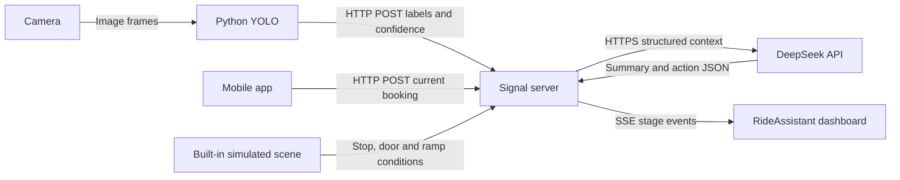

# Communication architecture for the competition demo

**App + Python YOLO → signal server → DeepSeek → dashboard.** There is no vehicle endpoint. The server receives JSON, holds the API key, combines input snapshots and returns English decision summaries and simulated actions.



## Protocol choices

| Connection | Implementation | Purpose |
|---|---|---|
| Camera → YOLO | Python / OpenCV | Capture and classify frames locally |
| YOLO → server | POST `/api/perception` | Labels, confidence and optional track ID |
| App → server | POST `/api/booking` | Booking and requested assistance |
| Server → DeepSeek | HTTPS Chat Completions | Single-call or two-turn generation |
| Server → dashboard | SSE `/api/events` | Input, summary and completed-action events |
| Dashboard → server | POST `/api/demo`, `/api/run`, `/api/settings` | Presets, reruns and generation mode |

SSE suits server-to-browser progress updates while buttons use POST. The implementation reads the event stream with fetch, supports an Authorization header and restores the full snapshot after reconnecting. [MDN SSE documentation](https://developer.mozilla.org/en-US/docs/Web/API/Server-sent_events/Using_server-sent_events)

HTTP + SSE is sufficient here; no MQTT broker or ROS installation is required. WebSocket is another option for sustained bidirectional communication, but the current app bookings and detection events do not require it. [MDN WebSocket documentation](https://developer.mozilla.org/en-US/docs/Web/API/WebSockets_API)

## Signal format

Both inputs use `{event_id, observed_at, payload}`. Every new event has a new ID. Retries retain the same ID, timestamp and body so the server can deduplicate them. Older observations cannot overwrite newer ones on the same channel.

Post an app booking to `/api/booking`:

```json
{
  "event_id": "app-booking-001",
  "observed_at": "2026-09-12T01:00:00.000Z",
  "payload": {
    "active": true,
    "intent": "BOARDING",
    "route_id": "DEMO_ROUTE",
    "stop_id": "DEMO_STOP",
    "accessibility_need": "WHEELCHAIR",
    "ramp_preference": "REQUESTED",
    "assistance_requested": ["WHEELCHAIR_RAMP", "ADDITIONAL_BOARDING_TIME"],
    "preferred_interaction": "VISUAL",
    "language": "en-SG"
  }
}
```

Post YOLO output to `/api/perception`:

```json
{
  "event_id": "yolo-frame-1042",
  "observed_at": "2026-09-12T01:00:00.000Z",
  "payload": {
    "yolo_detections": [{"label": "WHEELCHAIR", "confidence": 0.94}]
  }
}
```

These timestamps illustrate the format; send the actual capture time. The Python client generates timestamps and IDs. Only structured detections go to the server, not camera images. A track_id identifies a visual track, not a passenger.

For crutches, use `CRUTCH` without `WHEELCHAIR_RAMP`. Vision and hearing support use `VISUAL_ASSISTANCE` / `HEARING_ASSISTANCE`, with `AUDIO` / `VISUAL` interaction preferences. The six dashboard presets work before the app is available. All displayed summaries and passenger guidance use English.

## Simulated scene and snapshots

The server retains the latest booking and detections. It supplies a stopped vehicle, open door, stowed ramp, clear entrance, simulated approval and sample ramp geometry. Route and stop follow the booking. Context includes `presentation_mode: WEB_DEMO`; results report `vehicle_context_source: SIMULATED_SCENARIO`. These are presentation settings, not sensor readings.

Inputs are presentation snapshots. Reception metadata retains their timestamps; the last result stays visible after sending stops. A decision-changing input triggers a new run. Updates arriving close together are combined for about 250 ms. A superseded model response cannot overwrite the newer state.

The Python publisher waits for three stable frames and sends at most about once every 0.4 seconds. Repeated heartbeats and small confidence changes do not trigger another model request; crossing a policy threshold does. Deduplication retains the last 512 IDs. State is in memory and resets on restart. The prototype represents one active booking.

## Single call, two turns and rules

- `single`: one API call returns a short English summary and actions. Default mode.
- `two_turn`: turn 1 returns 1-3 short English summary items, pushed immediately; turn 2 uses the original context, policy and summary to produce actions.
- `rules`: no API call. The same policy runs locally, including in the browser for offline presets.

Thinking is a short audience-facing decision summary. The UI and JSON identify actual model output, rules and fallback. Action types and order are validated, and all actions remain simulated.

## Where to run it

For the competition, run the server and dashboard on one computer. Connect the phone and vision computer to the same LAN. The app sends to port `8787`, while the dashboard opens on port `3000`. Only the server needs internet access to call DeepSeek. See the root README for startup and LAN configuration.

GitHub Pages serves static files and cannot host this persistent signal server. Keep the existing Pages UI and connect a separate HTTPS server for a public live demo. A local presentation does not require buying a cloud server. [GitHub Pages documentation](https://docs.github.com/en/pages/getting-started-with-github-pages/what-is-github-pages)

Set `NEXT_PUBLIC_API_BASE_URL` or enter the server URL in Connection settings, and allow the website origin through `ALLOWED_ORIGINS`. DeepSeek credentials stay in the server process; app and Python clients use a separate `BRIDGE_TOKEN`. The existing publishing configuration is preserved; these edits have not been pushed or deployed.
