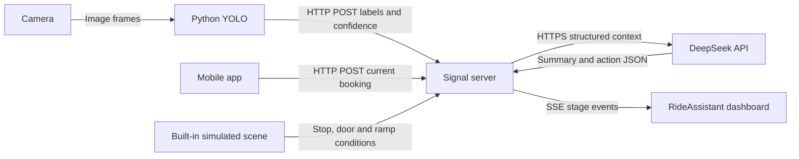

# Communication architecture for the competition demo

**App + Python YOLO → signal server → DeepSeek → dashboard.** There is no vehicle endpoint. The server receives JSON, holds the API key, combines input snapshots and returns English decision summaries and simulated actions.



## Protocol choices

| Connection | Implementation | Purpose |
|---|---|---|
| Camera → YOLO | Python / OpenCV | Capture and classify frames locally |
| YOLO → server | POST `/api/perception` | Labels, confidence and optional track ID |
| App → server | POST `/api/booking` | Booking and requested assistance |
| Server → DeepSeek | HTTPS Chat Completions | Single-call or two-turn generation |
| Server → dashboard | SSE `/api/events` | Input, summary and completed-action events |
| Dashboard → server | POST `/api/demo`, `/api/run`, `/api/settings` | Presets, reruns and generation mode |

SSE suits server-to-browser progress updates while buttons use POST. The implementation reads the event stream with fetch, supports an Authorization header and restores the full snapshot after reconnecting. [MDN SSE documentation](https://developer.mozilla.org/en-US/docs/Web/API/Server-sent_events/Using_server-sent_events)

HTTP + SSE is sufficient here; no MQTT broker or ROS installation is required. WebSocket is another option for sustained bidirectional communication, but the current app bookings and detection events do not require it. [MDN WebSocket documentation](https://developer.mozilla.org/en-US/docs/Web/API/WebSockets_API)

## Signal format

Both inputs use `{event_id, observed_at, payload}`. Every new event has a new ID. Retries retain the same ID, timestamp and body so the server can deduplicate them. Older observations cannot overwrite newer ones on the same channel.

Post an app booking to `/api/booking`:

```json
{
  "event_id": "app-booking-001",
  "observed_at": "2026-09-12T01:00:00.000Z",
  "payload": {
    "active": true,
    "intent": "BOARDING",
    "route_id": "DEMO_ROUTE",
    "stop_id": "DEMO_STOP",
    "accessibility_need": "WHEELCHAIR",
    "ramp_preference": "REQUESTED",
    "assistance_requested": ["WHEELCHAIR_RAMP", "ADDITIONAL_BOARDING_TIME"],
    "preferred_interaction": "VISUAL",
    "language": "en-SG"
  }
}
```

Post YOLO output to `/api/perception`:

```json
{
  "event_id": "yolo-frame-1042",
  "observed_at": "2026-09-12T01:00:00.000Z",
  "payload": {
    "yolo_detections": [{"label": "WHEELCHAIR", "confidence": 0.94}]
  }
}
```

These timestamps illustrate the format; send the actual capture time. The Python client generates timestamps and IDs. Only structured detections go to the server, not camera images. A track_id identifies a visual track, not a passenger.

For crutches, use `CRUTCH` without `WHEELCHAIR_RAMP`. Vision and hearing support use `VISUAL_ASSISTANCE` / `HEARING_ASSISTANCE`, with `AUDIO` / `VISUAL` interaction preferences. The six dashboard presets work before the app is available. All displayed summaries and passenger guidance use English.

## Simulated scene and snapshots

The server retains the latest booking and detections. It supplies a stopped vehicle, open door, stowed ramp, clear entrance, simulated approval, sample ramp geometry and a simulated cabin-occupancy snapshot. The trusted policy assigns an unoccupied seat or wheelchair bay in `boarding_target`; the model may explain but cannot change that target. Route and stop follow the booking. Context includes `presentation_mode: WEB_DEMO`; results report `vehicle_context_source: SIMULATED_SCENARIO`. These are presentation settings, not sensor readings.

Inputs are presentation snapshots. Reception metadata retains their timestamps; the last result stays visible after sending stops. A decision-changing input triggers a new run. Updates arriving close together are combined for about 250 ms. A superseded model response cannot overwrite the newer state.

The Python publisher waits for three stable frames and sends at most about once every 0.4 seconds. Repeated heartbeats and small confidence changes do not trigger another model request; crossing a policy threshold does. Deduplication retains the last 512 IDs. State is in memory and resets on restart. The prototype represents one active booking.

## Single call, two turns and rules

- `single`: one API call returns a short English summary and actions. Default mode.
- `two_turn`: turn 1 returns 1-3 short English summary items, pushed immediately; turn 2 uses the original context, policy and summary to produce actions.
- `rules`: no API call. The same policy runs locally, including in the browser for offline presets.

Thinking is a short audience-facing decision summary. The UI and JSON identify actual model output, rules and fallback. Action types and order are validated, and all actions remain simulated.

## Where to run it

For the competition, run the server and dashboard on one computer. Connect the phone and vision computer to the same LAN. The app sends to port `8787`, while the dashboard opens on port `3000`. Only the server needs internet access to call DeepSeek. See the root README for startup and LAN configuration.

GitHub Pages serves static files and cannot host this persistent signal server. Keep the existing Pages UI and connect a separate HTTPS server for a public live demo. A local presentation does not require buying a cloud server. [GitHub Pages documentation](https://docs.github.com/en/pages/getting-started-with-github-pages/what-is-github-pages)

Set `NEXT_PUBLIC_API_BASE_URL` or enter the server URL in Connection settings, and allow the website origin through `ALLOWED_ORIGINS`. DeepSeek credentials stay in the server process; app and Python clients use a separate `BRIDGE_TOKEN`. The existing publishing configuration is preserved; committing or pushing a feature branch does not by itself confirm a live deployment.

## v0.4 integration update — 2026-10-03

This section and the v0.4/v0.5 supplements in the root `PROMPT.md` supersede earlier journey and publisher details above. Existing endpoints, input envelopes, authentication and external App deployment options remain supported. Real DeepSeek validation is recorded below and in `HANDOFF.md` section 7.5; live-camera and independent-App acceptance remain outstanding.

### Three inputs and shared responses

| Round | Sender and input | Hub responsibility | Shared passenger response |
|---|---|---|---|
| Booking | App posts need and requested assistance to `/api/booking` | Create `BOOKED`; generate and validate the plan using the selected mode | Go to the marked boarding point |
| Arrival | CV posts `zone.event: enter`; `present` refreshes an occupied region | Require confirmed detections at confidence ≥0.75 matching the active booking | Arrival detected; play simulated bus arrival and preparation |
| Region exit | CV posts explicit `exit`, an empty detection list and matching `zone.left` | Bind it to the accepted visit; retain an early exit until planning and preparation finish | Play boarding and show the assigned seat or wheelchair bay |

CV reports observations; it does not read bookings or authorize vehicle movement. `exit` means the monitored region has cleared, not that the passenger is seated or secured. There is no “about to leave” event in v0.4. The first arrival display lasts 4200 ms within a 10000 ms preparation phase, and all vehicle behavior remains simulated.

The optional `zone.visit_id` joins one region activation's `enter`, `present` and `exit`. The bridge generates a 12-character UUID for each activation. It identifies a visit, not a person. Keep the ID unchanged when retrying or sending heartbeats for that visit. Older senders can retain their existing ROI and event metadata.

On `exit` the bridge may add `zone.boarding` (boolean, its estimate of boarding intent) and `zone.dwell_seconds` (how long the region was occupied). `boarding: false` (a short stay, or the passenger walked off another way) is not boarding: the journey returns to `BOOKED` with `reason: 'not_boarding'` and waits for the passenger again. `true` or an absent field keeps the behaviour above.

### Validated destinations

The 18-action contract adds `GUIDE_PASSENGER_TO_ASSIGNED_PLACE` between boarding confirmation and seated/belted confirmation. The server supplies its `{target_type, target_id}` parameters. `Result.boarding_target` is `null`, `{type:'SEAT',id:'S01'…'S16'}` or `{type:'WHEELCHAIR_BAY',id:'WHEELCHAIR_BAY'}`.

The hub injects the accepted booking envelope's ID as the read-only planner input `booking_event_id`; no new App input field is required. Trusted policy uses this stable ID and simulated cabin occupancy to select a free position. Repeated planning of the same booking does not choose a new seat. A different booking can receive a different free seat. Wheelchair bookings target the bay; asking for a ramp does not change a walking passenger into a wheelchair passenger. The LLM must return the policy-assigned destination, which is checked before producing the Result.

### Complete snapshots and animation identity

`snapshot.journey` retains `stage`, `need`, `labels`, `matched`, `seat` and `guidance`, and adds `journey_id`, `revision`, `completed`, `pending_exit`, `boarding_target` and `animation`. The booking event ID becomes the journey ID. A completed booking is not reused for later CV arrivals.

Each journey transition, planning completion, cancellation and expiry broadcasts a complete `snapshot`. The existing `result` event carries `{run_id,result,snapshot}`. The new `navigation` event carries `{navigation,snapshot}`, with a navigation object `{id,revision,phase,destination,instruction,simulated,animation}`. Apply the latest complete snapshot to both clients. Older clients can continue reading `result.passenger_communication`; new clients should display `journey.guidance` for stage-specific messages.

`journey.animation` is `null` or `{id, phase:'arrival'|'boarding', aid, started_at, duration_ms, target}`. Times are hub epoch milliseconds. Clients deduplicate by animation ID and derive the remaining progress from the start time. Heartbeats, duplicate input IDs, snapshot refreshes and reconnects must not restart animations. The dashboard may also display the short `summary`; the passenger App shows guidance and the assigned position instead of planner implementation details.

The passenger App is a separate project; this repository does not implement phone UI. The hub delivers navigation and authoritative journey snapshots over the existing HTTP/SSE interfaces. Configure the App's hub URL, Bearer token, allowed origin and compatible HTTP/HTTPS setup as described above; the App is responsible for rendering those optional fields.

### v0.5: directional cabin guidance

The same LLM response now verbalizes a trusted interior route, not just a seat ID. `Result.cabin_navigation` is nullable; when present it contains `layout_id`, `origin:{type:'ENTRANCE',id:'SINGLE_ENTRANCE',facing:'INTO_BUS'}`, `target`, `steps`, `mode:'map_based'`, `simulated:true`, and `requires_operator:true`. Each step contains `step`, `maneuver:START|STRAIGHT|TURN_LEFT|TURN_RIGHT|ARRIVE`, `distance_m:number|null` and English `text`. Distances are approximate horizontal metres in the simulated cabin, not live measurements. The server checks the LLM's sequence and distances against the geometry before publishing.

`Snapshot.navigation.cabin_route` carries the prepared interior route immediately after planning; `navigation.steps` is empty before the boarding phase and carries the same steps in `TO_SEAT` / `TO_WHEELCHAIR_BAY`. Its `instruction` contains those spoken-style steps. Turns are relative to the passenger's current heading, starting at the interior threshold and facing into the bus. For S03, the route is approximately: straight 0.9 m, right, straight 0.7 m, right, straight 0.5 m, then stop for operator assistance. The App still uses `/api/events` or `/api/state`; no new input API is required. Without passenger localisation or step acknowledgements, this is a map-based route description, not turn-by-turn live tracking.

### Delivery and validation

`yolo_bridge.py` now uses a background FIFO outbox. Failed delivery retains the exact event ID, observation time and body, and retries the oldest event first. Only adjacent, never-attempted `present` events for the same visit can be coalesced; transitions and attempted envelopes are kept. The outbox is in memory, and shutdown reports any pending count rather than claiming persistence.

Vision health exposes `pending_signals`, `signal_error` and the last acknowledged `last_signal`, without exposing credentials. Pure vision tests pass 31 checks: the existing 21 plus 10 delivery tests. Dashboard has 81 passing checks and the twin has 12. A real DeepSeek single-call check passed for wheelchair, cane, stroller and visual assistance over authenticated HTTP/SSE, including all three feedback rounds and directional navigation. CV events in that check are simulated, not a physical-camera or external-App acceptance test. Run `node scripts/check-journey.mjs --key-stdin` from `dashboard/` to repeat it; it makes four paid model calls and rejects rules/fallback results. See `HANDOFF.md` section 7.5 for the acceptance record.
