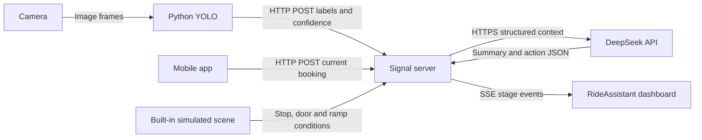

# Communication architecture for the competition demo

**App + Python YOLO → signal server → DeepSeek → dashboard.** There is no vehicle endpoint. The server receives JSON, holds the API key, combines input snapshots and returns English decision summaries and simulated actions.



## Protocol choices

| Connection | Implementation | Purpose |
|---|---|---|
| Camera → YOLO | Python / OpenCV | Capture and classify frames locally |
| YOLO → server | POST `/api/perception` | Labels, confidence and optional track ID |
| App → server | POST `/api/booking` | Booking and requested assistance |
| Server → DeepSeek | HTTPS Chat Completions | Single-call or two-turn generation |
| Server → dashboard | SSE `/api/events` | Input, summary and completed-action events |
| Dashboard → server | POST `/api/demo`, `/api/run`, `/api/settings` | Presets, reruns and generation mode |

SSE suits server-to-browser progress updates while buttons use POST. The implementation reads the event stream with fetch, supports an Authorization header and restores the full snapshot after reconnecting. [MDN SSE documentation](https://developer.mozilla.org/en-US/docs/Web/API/Server-sent_events/Using_server-sent_events)

HTTP + SSE is sufficient here; no MQTT broker or ROS installation is required. WebSocket is another option for sustained bidirectional communication, but the current app bookings and detection events do not require it. [MDN WebSocket documentation](https://developer.mozilla.org/en-US/docs/Web/API/WebSockets_API)

## Signal format

Both inputs use `{event_id, observed_at, payload}`. Every new event has a new ID. Retries retain the same ID, timestamp and body so the server can deduplicate them. Older observations cannot overwrite newer ones on the same channel.

Post an app booking to `/api/booking`:

```json
{
  "event_id": "app-booking-001",
  "observed_at": "2026-09-12T01:00:00.000Z",
  "payload": {
    "active": true,
    "intent": "BOARDING",
    "route_id": "DEMO_ROUTE",
    "stop_id": "DEMO_STOP",
    "accessibility_need": "WHEELCHAIR",
    "ramp_preference": "REQUESTED",
    "assistance_requested": ["WHEELCHAIR_RAMP", "ADDITIONAL_BOARDING_TIME"],
    "preferred_interaction": "VISUAL",
    "language": "en-SG"
  }
}
```

Post YOLO output to `/api/perception`:

```json
{
  "event_id": "yolo-frame-1042",
  "observed_at": "2026-09-12T01:00:00.000Z",
  "payload": {
    "yolo_detections": [{"label": "WHEELCHAIR", "confidence": 0.94}]
  }
}
```

These timestamps illustrate the format; send the actual capture time. The Python client generates timestamps and IDs. Only structured detections go to the server, not camera images. A track_id identifies a visual track, not a passenger.

For crutches, use `CRUTCH` without `WHEELCHAIR_RAMP`. Vision and hearing support use `VISUAL_ASSISTANCE` / `HEARING_ASSISTANCE`, with `AUDIO` / `VISUAL` interaction preferences. The six dashboard presets work before the app is available. All displayed summaries and passenger guidance use English.

## Simulated scene and snapshots

The server retains the latest booking and detections. It supplies a stopped vehicle, open door, stowed ramp, clear entrance, simulated approval, sample ramp geometry and a simulated cabin-occupancy snapshot. The trusted policy assigns an unoccupied seat or wheelchair bay in `boarding_target`; the model may explain but cannot change that target. Route and stop follow the booking. Context includes `presentation_mode: WEB_DEMO`; results report `vehicle_context_source: SIMULATED_SCENARIO`. These are presentation settings, not sensor readings.

Inputs are presentation snapshots. Reception metadata retains their timestamps; the last result stays visible after sending stops. A decision-changing input triggers a new run. Updates arriving close together are combined for about 250 ms. A superseded model response cannot overwrite the newer state.

The Python publisher waits for three stable frames and sends at most about once every 0.4 seconds. Repeated heartbeats and small confidence changes do not trigger another model request; crossing a policy threshold does. Deduplication retains the last 512 IDs. State is in memory and resets on restart. The supported demo is one phone serving one passenger after another; several phones are tolerated through a waiting list (see the last section).

## Single call, two turns and rules

- `single`: one API call returns a short English summary and actions. Default mode.
- `two_turn`: turn 1 returns 1-3 short English summary items, pushed immediately; turn 2 uses the original context, policy and summary to produce actions.
- `rules`: no API call. The same policy runs locally, including in the browser for offline presets.

Thinking is a short audience-facing decision summary. The UI and JSON identify actual model output, rules and fallback. Action types and order are validated, and all actions remain simulated.

## Where to run it

For the competition, run the server and dashboard on one computer. Connect the phone and vision computer to the same LAN. The app sends to port `8787`, while the dashboard opens on port `3000`. Only the server needs internet access to call DeepSeek. See the root README for startup and LAN configuration.

GitHub Pages serves static files and cannot host this persistent signal server. Keep the existing Pages UI and connect a separate HTTPS server for a public live demo. A local presentation does not require buying a cloud server. [GitHub Pages documentation](https://docs.github.com/en/pages/getting-started-with-github-pages/what-is-github-pages)

Set `NEXT_PUBLIC_API_BASE_URL` or enter the server URL in Connection settings, and allow the website origin through `ALLOWED_ORIGINS`. DeepSeek credentials stay in the server process; app and Python clients use a separate `BRIDGE_TOKEN`. The existing publishing configuration is preserved; committing or pushing a feature branch does not by itself confirm a live deployment.

## v0.4 integration update — 2026-10-03

This section and the v0.4/v0.5/v0.6 supplements in the root `PROMPT.md` supersede earlier journey and publisher details above. Existing endpoints, input envelopes, authentication and external App deployment options remain supported. Real DeepSeek validation is recorded below and in `HANDOFF.md` section 7.5; live-camera and independent-App acceptance remain outstanding.

### Three inputs and shared responses

| Round | Sender and input | Hub responsibility | Shared passenger response |
|---|---|---|---|
| Booking | App posts need and requested assistance to `/api/booking` | Create `BOOKED`; generate and validate the plan using the selected mode | Go to the marked boarding point |
| Arrival | CV posts `zone.event: enter`; `present` refreshes an occupied region | Require confirmed detections at confidence ≥0.75 matching the active booking | Arrival detected; play simulated bus arrival and preparation |
| Region exit | CV posts explicit `exit`, an empty detection list and matching `zone.left` | Bind it to the accepted visit; retain an early exit until planning and preparation finish | Play boarding and show the assigned seat or wheelchair bay |

CV reports observations; it does not read bookings or authorize vehicle movement. `exit` means the monitored region has cleared, not that the passenger is seated or secured. There is no “about to leave” event in v0.4. The first arrival display lasts 4200 ms within a 10000 ms preparation phase, and all vehicle behavior remains simulated.

The optional `zone.visit_id` joins one region activation's `enter`, `present` and `exit`. The bridge generates a 12-character UUID for each activation. It identifies a visit, not a person. Keep the ID unchanged when retrying or sending heartbeats for that visit. Older senders can retain their existing ROI and event metadata.

On `exit` the bridge may add `zone.boarding` (boolean, its estimate of boarding intent) and `zone.dwell_seconds` (how long the region was occupied). `boarding: false` (a short stay, or the passenger walked off another way) is not boarding: the journey returns to `BOOKED` with `reason: 'not_boarding'` and waits for the passenger again. `true` or an absent field keeps the behaviour above.

### Validated destinations

The 18-action contract adds `GUIDE_PASSENGER_TO_ASSIGNED_PLACE` between boarding confirmation and seated/belted confirmation. The server supplies its `{target_type, target_id}` parameters. `Result.boarding_target` is `null`, `{type:'SEAT',id:'S01'…'S16'}` or `{type:'WHEELCHAIR_BAY',id:'WHEELCHAIR_BAY'}`.

The hub injects the accepted booking envelope's ID as the read-only planner input `booking_event_id`; no new App input field is required. Trusted policy uses this stable ID and simulated cabin occupancy to select a free position. Repeated planning of the same booking does not choose a new seat. A different booking can receive a different free seat. Wheelchair bookings target the bay; asking for a ramp does not change a walking passenger into a wheelchair passenger. The LLM must return the policy-assigned destination, which is checked before producing the Result.

### Complete snapshots and animation identity

`snapshot.journey` retains `stage`, `need`, `labels`, `matched`, `seat` and `guidance`, and adds `journey_id`, `revision`, `completed`, `pending_exit`, `boarding_target` and `animation`. The booking event ID becomes the journey ID. A completed booking is not reused for later CV arrivals.

Each journey transition, planning completion, cancellation and expiry broadcasts a complete `snapshot`. The existing `result` event carries `{run_id,result,snapshot}`. The new `navigation` event carries `{navigation,snapshot}`, with a navigation object `{id,revision,phase,destination,instruction,simulated,animation}`. Apply the latest complete snapshot to both clients. Older clients can continue reading `result.passenger_communication`; new clients should display `journey.guidance` for stage-specific messages.

`journey.animation` is `null` or `{id, phase:'arrival'|'boarding', aid, started_at, duration_ms, target, equipment_target?, docked?}`. `duration_ms` is 10000 for the arrival (3000 with `docked:true` on a bus that is already at the stop), 16000 for boarding, 22000 for STROLLER boarding; `equipment_target` is the stroller's parking bay (v0.6), null otherwise. Times are hub epoch milliseconds. Clients deduplicate by animation ID and derive the remaining progress from the start time. Heartbeats, duplicate input IDs, snapshot refreshes and reconnects must not restart animations. The dashboard may also display the short `summary`; the passenger App shows guidance and the assigned position instead of planner implementation details.

The native passenger App is now included under `app/` by main@353765a; this dashboard integration does not modify its UI. The hub delivers navigation and authoritative journey snapshots over the existing HTTP/SSE interfaces. Configure the App's hub URL, Bearer token, allowed origin and compatible HTTP/HTTPS setup as described above; the App is responsible for rendering those optional fields. See `HANDOFF-APP.md` and `RUNBOOK.md` at the repository root.

### v0.5: directional cabin guidance

The same LLM response now verbalizes a trusted interior route, not just a seat ID. `Result.cabin_navigation` is nullable; when present it contains `layout_id`, `origin:{type:'ENTRANCE',id:'SINGLE_ENTRANCE',facing:'INTO_BUS'}`, `target`, `steps`, `mode:'map_based'`, `simulated:true`, and `requires_operator:true`. Each step contains `step`, `maneuver:START|STRAIGHT|TURN_LEFT|TURN_RIGHT|ARRIVE`, `distance_m:number|null` and English `text`. Distances are approximate horizontal metres in the simulated cabin, not live measurements. The server checks the LLM's sequence and distances against the geometry before publishing.

`Snapshot.navigation.cabin_route` carries the prepared interior route immediately after planning; `navigation.steps` is empty before the boarding phase and carries the same steps in `TO_SEAT` / `TO_WHEELCHAIR_BAY`. Its `instruction` contains those spoken-style steps. Turns are relative to the passenger's current heading, starting at the interior threshold and facing into the bus. For S03, the route is approximately: straight 0.9 m, right, straight 0.7 m, right, straight 0.5 m, then stop for operator assistance. The App still uses `/api/events` or `/api/state`; no new input API is required. Without passenger localisation or step acknowledgements, this is a map-based route description, not turn-by-turn live tracking.

### v0.6: park the stroller before nearby seating

For `STROLLER`, `boarding_target` is the person's free seat, preferring S02/S03. If both are occupied, use the next available tier S05/S06, then S08/S09; never bypass a nearer available tier. These six low-floor aisle seats have supported paths without crossing window seats or rear steps. Optional `equipment_target` is `{type:'WHEELCHAIR_BAY',id:'WHEELCHAIR_BAY'}`. The bay and F01 must be unoccupied. If all six supported seats or the parking bay are unavailable, request operator confirmation. `WHEELCHAIR` keeps the person and chair together at the bay and has no separate equipment target.

`Result.cabin_navigation`, `journey`, `journey.animation` and `Snapshot.navigation` carry the optional `equipment_target`. Stroller directions first reach the bay parking point, include a `PARK_STROLLER` maneuver with null distance and operator-assistance text, then continue to the person's seat. Clients should render its `text`; the final seat is not the stroller's destination. The original input endpoints and action enum remain unchanged.

The twin receives optional `passengerJourney.equipmentDestination`. In the new stroller preview, the person stops at the handle position (x=-1.55,z=0.08) while the stroller centres in the bay (x=-1.55,z=-0.54), then walks to the assigned seat. The parked stroller remains visible after the seated actor hand-off. Farther-seat paths use their own aisle distances and parking progress, rather than reusing S03 geometry. Its open-loop boarding preview lasts 22000 ms; other categories remain at 16000 ms. A consumed stroller journey reserves both bay and seat in the simulated cabin. These fields do not authorize real securement or departure.

The latest main serves one passenger per simulated bus: a booking that arrives when no other booking is waiting or in progress, after a journey has completed, resets the cabin to the fixture, representing a fresh bus. A booking that overlaps another one (see the waiting list below) shares its bus. No real occupancy or departure is inferred.

### Delivery and validation

`yolo_bridge.py` now uses a background FIFO outbox. Failed delivery retains the exact event ID, observation time and body, and retries the oldest event first. Only adjacent, never-attempted `present` events for the same visit can be coalesced; transitions and attempted envelopes are kept. The outbox is in memory, and shutdown reports any pending count rather than claiming persistence.

Vision health exposes `pending_signals`, `signal_error` and the last acknowledged `last_signal`, without exposing credentials. Pure vision tests pass 31 checks: the existing 21 plus 10 delivery tests. The v0.6 dashboard has 100 passing checks and the twin has 15. The v0.5 real DeepSeek check passed for four categories; v0.6 has additionally passed real stroller via-bay parking, farther-seat fallback when S02/S03 are full, and wheelchair direct-to-bay navigation over authenticated HTTP/SSE. CV inputs are simulated, not a physical-camera or external-App acceptance test. Run `node scripts/check-journey.mjs --key-stdin --categories STROLLER,WHEELCHAIR` from `dashboard/` for two paid model calls, or omit `--categories` for four. Add `--categories STROLLER --stroller-nearby-full` to test the farther-seat branch in one paid call. Each category uses an independently reset simulated cabin; same-bus resource contention is covered by regression tests. Rules/fallback results cannot pass the paid check. See `HANDOFF.md` sections 7.5 and 9 for acceptance records.

### Continuous one-at-a-time runs (2026-10-03)

One passenger at a time, boarding in sequence; the journey must never stick, so runs can follow each other without restarting the hub. No new endpoint or field; one new `journey.reason` value, `presence_lost`.

- **Coming back during `pending_exit`.** An `enter`/`present` whose confirmed labels match the booking (new or same `visit_id`) cancels the held exit: `pending_exit:false`, `stage:'AT_STOP'`, `matched:true`, `reason:'entered'`, `visit_id` follows the new visit. The arrival animation keeps its ID and start time. The next proper `exit` of that visit boards as usual. Other aids entering meanwhile leave the held exit alone.
- **Lost exit (presence timeout).** While `AT_STOP` without a held exit, the hub times the journey's visit by its own receive clock (camera clocks are not used). After `PRESENCE_LOST_MS` = 8000 ms (about four missed 2 s heartbeats) with no signal for that `visit_id`: if the passenger matched and the 10 s arrival preparation had completed by then ("Ready to board"), the disappearance counts as having left to board: the exit becomes pending and the journey goes `ON_BOARD` (`reason:'boarding_preview'`) exactly as after an `exit`. Otherwise (unmatched, still confirming, plan not ready or arrival not complete) it returns to `BOOKED` with `reason:'presence_lost'` and waits again. Only visit-bound journeys are timed: bookings without any camera, and a manual `enter` without `visit_id` (curl, no heartbeats), behave as before. A held exit is not timed.
- **TTL at the stop.** The 5-minute booking TTL does not expire a journey that is `AT_STOP` and matched (including a held exit). It keeps counting from the booking's `observed_at`: a journey that returns to `BOOKED` after more than 5 minutes expires at that moment.
- **Sequential bookings.** Superseded by the waiting list below: a booking no longer replaces a journey that is waiting or in progress. After `ON_BOARD` (the normal one-phone case) the next booking starts at once on a fresh bus, as before, even while the previous boarding animation (16 s, 22 s for strollers) is still playing. As before, a booking takes over a region occupant reported in the last 5 s.

### One phone, next passenger, and the waiting list (2026-10-03)

**Supported use: one phone at a time.** One phone books one passenger after another (wheelchair, stroller, cane, …); every journey is independent and gets a fresh simulated bus with every place free. After boarding, the phone's Finish button sends the existing cancel with the journey ID; the phone resets itself, while the dashboard keeps the boarded journey until the operator presses Reset or the next passenger books. Several phones are tolerated through a waiting list, but that is a safety net, not a demo goal. Nothing the camera sends changed. The App sends one new optional field.

**Request.** `POST /api/booking` is unchanged. A cancel is `active:false`; the new optional payload field `cancels: "<journey_id>"` (the booking's `event_id`; also accepted on the envelope) names the booking to end. Without it, the hub ends the live booking whose need equals the payload's `accessibility_need` if exactly one exists. Otherwise it ends the journey in progress, else the only live booking, else the boarded journey on screen. Optional payload `operator_reset: true` is sent only by the dashboard's Reset button (see the table below: only with it does a boarded journey end). A cancel naming an unknown or already ended journey is accepted and changes nothing: `202 {accepted:true, duplicate:false, changed:false, journey_id:null}`. A cancel older than the booking it names is `400 OUT_OF_ORDER_SIGNAL`. The global out-of-order check on the booking channel was removed so that phones with different clocks cannot reject each other.

**Replies.** An accepted booking returns `202 {accepted:true, duplicate:false, changed:true, journey_id, queued, position}`. A retry with the same ID returns `{accepted:true, duplicate:true, changed:false, journey_id, queued, position}`. A second live booking for a need that already has one returns `409 {error:"NEED_ALREADY_BOOKED", need, existing_journey_id}`; the first booking stays. The rejected event ID is not remembered, so the App's "Try again" (same ID, new `observed_at`) is accepted once the need is free. A cancel returns `202 {…, changed, journey_id:<ended journey or null>}`.

**Rules.**

| Situation | What happens | Phones show |
|---|---|---|
| Booking while no booking waits or is in progress | Planned once; after a completed journey it gets a fresh bus | That phone: as before |
| Same need again while that booking is live | `409 NEED_ALREADY_BOOKED` | The new phone: error; the first: unchanged |
| Booking while others wait or one is in progress | Joins the list and is planned once at once on the same bus; places held by the other bookings of this bus count as taken | `queued:true`, `position:n`; guidance names the passengers ahead |
| Second wheelchair-bay booking on the bus (wheelchair, stroller) | Plan `NEEDS_CONFIRMATION` (`NO_ACCESSIBLE_PLACE_AVAILABLE`); kept, not boardable, `reason:'no_place'` | "No place on this bus" … wait for the safety operator |
| Nobody in progress; the camera reports an aid in the region | The oldest waiting booking whose aid matches (confidence ≥0.75, confirmed) becomes the journey in progress | That phone: `AT_STOP` |
| Someone in progress (matched at the stop or exit held), another waiting passenger is seen in the region | Not released | `reason:'waiting_turn'`: "We see you at the stop. Please wait, another passenger is boarding." |
| The journey in progress boards (`ON_BOARD`) | The stop is free at once; the next matching waiting booking is released (now from the latest heartbeat if it is ≤5 s old, else at its next enter or present) | Boarded phone: its `ON_BOARD` entry; next phone: `AT_STOP` |
| Journey in progress walks off, presence lost, or a new visit without its aid | Back to the list as `BOOKED`, keeping its age | `queued:true` again |
| Phone Finish on a boarded journey (`cancels` its ID, no `operator_reset`) | `202`, nothing visible changes: the top-level journey stays `ON_BOARD` with its animation, result and navigation; the bus is not reset. Its `journeys[]` entry gets `passenger_finished:true` | The phone has already reset itself; the dashboard is unchanged |
| Dashboard Reset (`cancels` + `operator_reset:true`) of a boarded journey | Ends at once: `stage:'IDLE'`, `reason:'completed'`, `completed:true`, no animation, clean idle screen; fresh bus if no one else is waiting | "No active booking"; the next waiting booking takes the screen |
| Next booking after a phone Finish, no dashboard Reset | Starts at once (the stop freed at `ON_BOARD`); the dashboard switches to it; fresh bus if nothing else waits | As for any booking |
| Cancel before boarding (phone, or dashboard Reset with the flag) | `stage:'IDLE'`, `reason:'cancelled'` | "Booking cancelled" |
| Last bookable passenger of a bus boarded, `no_place` bookings left | A fresh bus comes and those bookings are planned again (one more planner call each) | "Booking received" → "Go to the bus stop" |

With exactly one booking in the list, everything behaves as before the list. That includes showing an unmatched aid as `AT_STOP` unmatched and the booking-time takeover. With several, the camera releases only by a visible aid (`VISIBLE` table in `journey.mjs`, e.g. `VISUAL_ASSISTANCE`↔`CANE`). If two waiting categories are in the region together, the older booking wins. A need without a visible aid (e.g. `HEARING_ASSISTANCE`) is released only when it is the only booking waiting. A plan that is not `READY` is never released by the camera. If a journey in progress receives such a plan, it returns to the list. A held exit or a heartbeat of another aid never touches the passenger in progress. Each live booking has the 5-minute TTL, frozen only for the matched journey in progress; that journey's planner input never ages past 5 minutes, so a long wait at the stop no longer loses the plan on leaving. The planner runs once per accepted booking, serialized in booking order so places cannot collide; the only extra call is the re-plan of a `no_place` booking on a fresh bus. Restarting the hub clears everything.

**Snapshot.** `journey`, `navigation`, `result`, `summary`, `context` and `running` describe the journey in progress. If none is in progress, they describe the oldest waiting booking. If nothing waits, they describe the last ended journey (a boarded one stays `ON_BOARD` until the dashboard's Reset or the next booking; the phone's Finish does not end it). With one booking, this is exactly as before. `running` is non-null only while the plan of that shown booking is being made. New `journeys` lists one entry per booking, oldest first: waiting, in progress, and ended ones for `FINISHED_RETAIN_MS` = 120000 ms after they ended. Each entry has the shape of `journey` (with its `guidance`) plus `queued` (waiting, not in progress), `passenger_finished` (the phone pressed Finish after boarding), `position` (live bookings ahead of it: the one in progress plus older waiting ones; 0 when in progress or ended), `plan_status`, `planning` (its plan is being made) and `navigation` (its own, or null). Ended entries keep `journey_id`; their `stage` is `ON_BOARD` if boarded and not reset, otherwise `IDLE` with `need:null` and `reason` `cancelled`, `expired` or `completed`. **Idle screen:** when the last booking ends (reset, cancel or expiry) and nothing waits, nothing is replanned. Top-level `result`, `summary` and `navigation` are null, and `context.request` is `{active:false}` without the old need. Before the waiting list, a cancel replanned by the rules (NEEDS_CONFIRMATION, "Boarding assistance needs are unconfirmed"). A camera report of an aid afterwards is still planned by the rules as camera-only input, as before.

**Events.** `planning`, `summary`, `result`, `cancelled` and `failure` keep their names for the plan shown at the top level and add `journey_id`. Plans of other bookings of the list use `journey_planning`, `journey_summary`, `journey_result`, `journey_cancelled` and `journey_failure`. Every change is followed by a full `snapshot`.

**Arrival of a later passenger of the same bus.** After a bus has boarded somebody, it stays at the stop. The next passenger of that bus (an overlapping booking) gets `journey.animation = {phase:'arrival', duration_ms: DOCKED_ARRIVAL_MS (3000), docked:true, …}` instead of the 10 s drive-in: guidance "Preparing to board", then "Ready to board" and `BOARD_BUS` after 3 s. A held exit boards when those 3 s are over. The first passenger of every bus keeps `duration_ms: ARRIVAL_MS` (10000), with no `docked` field. The twin (`twinScenario.ts`) treats an arrival with `duration_ms ≤ 5000` as docked: no drive-in, door and ramp first. Its "Ready" step waits for the ramp (4.1 s with a ramp), so with a ramp the twin is ready about 1 s after the phone.

**Limits.** The camera reports one region. The next passenger should step into it only after the previous one has left it. If both stand in it together, the visit keeps both aids and the region only reports an exit when both have gone.

## Who confirms an aid (2026-10-03)

Whether a detection really is a cane, wheelchair or stroller is decided once, by the camera bridge: it sends
an aid with `target_match_confirmed: true` only after its own rules hold (held or occupied by a person, seen
repeatedly). The hub matches the label of a confirmed target against the booking and does not apply the 0.75
confidence threshold to it; `confidence` of a confirmed target is informational (a running score that starts
low for an aid that has just come into view). The threshold still judges unconfirmed detections
(`target_match_confirmed` false or absent), which never start the arrival.

On exit, `zone.boarding` is false only for a stay under 2 s or when the passenger walked back, away from the
bus side (`why: walked_back` in the bridge log); leaving ahead or sideways is boarding.
